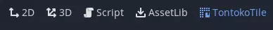
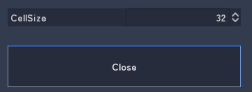
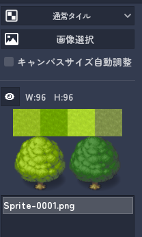
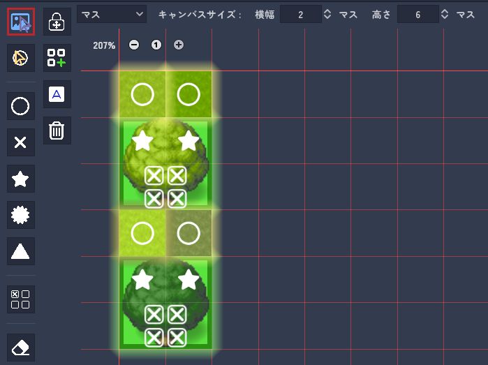
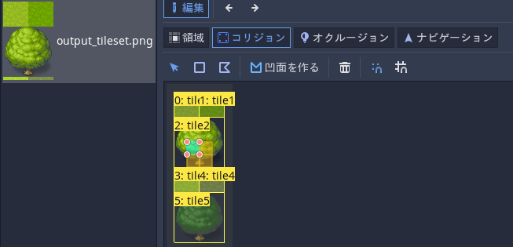
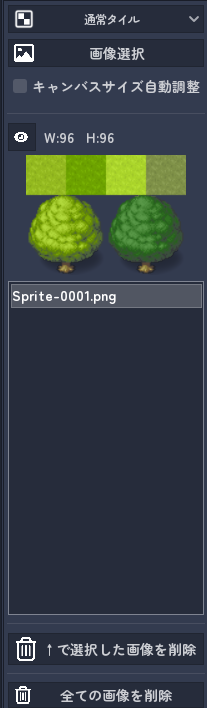
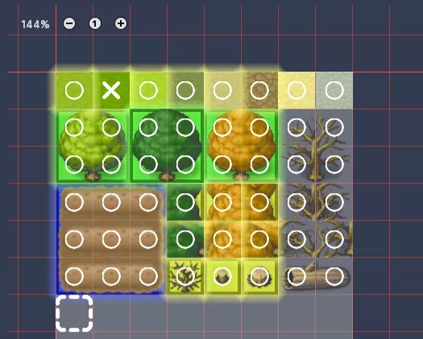
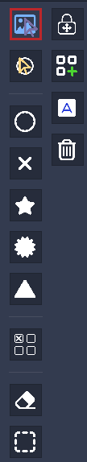
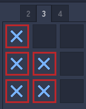

# 使い方

---

上部ワークスペースに TontokoTile が追加されています。

**※「タイル設定」のCellSizeを設定する**

追加する画像の種類を選択します。

「通常タイル」「オートタイルウディタ形式」「オートタイルツクール形式」から選択します。

「画像選択」で画像追加します。

マークをつけて通行設定をします。

**マークは、ドラッグでまとめて矩形マークできます。**

複数シングルタイル化やオートタイル化をします。

出力するマス範囲を「キャンバスサイズ」で設定します。

出力パスを指定して「出力！」ボタンを押します。

tresファイル、画像ファイルが作成されます。

# タイル設定

下部にタイル設定があります。

- タイル設定ボタン
   - 
- 各マークに対応するZindexの設定
- キャンバス背景は透明で出力するかどうか
- TileSet、出力PNG画像の出力パス（res:// 形式か、OSファイルパス形式かどちらでもOK）
- 出力ボタン！

# 画像追加

- 「画像選択」　追加するタイル画像を選択します。

- キャンバスサイズ自動調整
  - チェックが入っていると、画像がはみだす場合にキャンバスサイズが合わせて大きくなります。

- ↑で選択した画像を削除
  - リストで選択した画像を削除します。
  - ただし、シングルタイル化やオートタイル化したものは消えません。
- 全ての画像を削除

# キャンバス操作

## 操作

タイルの位置いれかえや通行設定のマークをつけます。

#### キャンバス上の画像・マーク選択のやり方

を選択すると画像を、を選択するとマークが対象になります。

ズーム：Ctrl+マウスホイール　または左上の+-ボタン

選択：左クリック、複数選択：Ctrl+左クリック

矩形選択：左ドラッグ、複数矩形選択：Ctrl+左ドラッグ

削除（マークのみ）：右クリック

矩形削除：右ドラッグ

ズーム中はキャンバス線の表示が消えます。100%にすると表示されます。

選択中のタイルには色が付きます。選択したタイルの種類によって色は変わります。

- 通常タイル＝黄色
- 複数シングルタイル＝緑色
- オートタイル＝青色

## キャンバス上部メニュー

- キャンバスサイズの指定をマス/ピクセルにする
- キャンバスサイズ
   - キャンバスサイズ外の画像、マークは画像出力されません。tilesetにも含まれません。
- マーク色変更
- キャンバス背景色変更
   - *キャンバス背景は透明で出力* にチェックが入っている場合は、この色が背景色になります。
- グリッド色変更

# ボタン・マーク説明

**マークは、ドラッグでまとめてマークできます。**

#### 各マークについて

#### 画像移動

ショートカットキー：Q

画像の移動、選択をします。

#### マーク移動

ショートカットキー：W

マークの移動、選択をします。

#### 丸マーク

ショートカットキー：１

通行可能タイルにします。印ペイントなしと全く同じです。

#### バツマーク

ショートカットキー：２

タイルを通行不可にします。※1

#### 星マーク

ショートカットキー：３

常にキャラの上に表示します。※1

下をくぐって通れます。

#### 星マーク２

ショートカットキー：４

常にキャラの上に表示します。※1

下をくぐって通れません。

#### 三角マーク

ショートカットキー：５

後ろに行くと隠れます。※1

#### 詳細バツマーク

ショートカットキー：６

マークを削除します。

1/2, 3/1, 1/4 サイズで通行禁止にします。

他マークと同マスに置けます。

そのマスのすべての通行設定は詳細バツマークの内容になります。

#### 消しゴム

ショートカットキー：E

マークを削除します。

ペイントツール中に右ドラッグでも削除可能です。

#### マスカーソル

ショートカットキー：C

マスカーソルを移動します。

キャンバスへの画像追加はマスカーソル位置に追加されます。

※1 Zindexが変わるというだけです。重なり順については下部のZindexの値が入ります。キャラがZindex=0という想定です。必要なら変更してください。

### 2列目

#### 移動ロック

ショートカットキー：Ｌ

画像がドラッグで移動しないようにします。

#### シングルタイル化

ショートカットキー：Ｓ

選択中の複数画像タイルが矩形の場合にボタンを押すことができます。

複数タイルを１つのシングルタイルにします。

#### オートタイル化

ショートカットキー：Ａ

選択中の複数画像タイルをオートタイルにします。

対応…1x3, 3x1, 3x2, 3x3, 3x3(真ん中穴)

#### 削除

ショートカットキー：Delete

選択中の画像またはマークを削除します。

