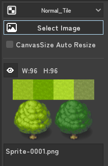
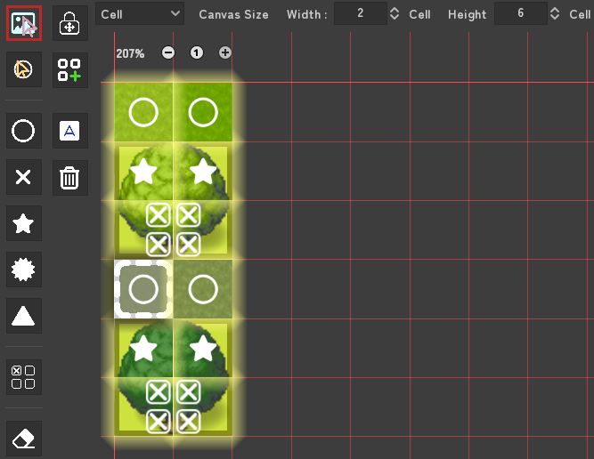
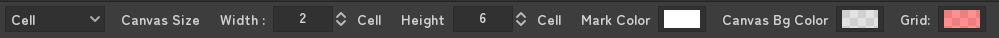
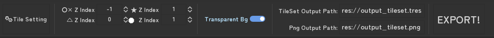
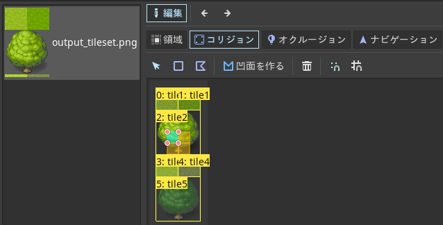

# How to Use

---

TontokoTile Tab has been added to the top workspace.

*** Set the Cell Size in "Tile Settings"**

Select the type of image you want to add.

"Normal Tile" "AutoTile Wolf Editor" "AutoTile RPGMaker"

Add an image with "Select Image".

Add a mark and set Tile Passage.

**Can mark rectangles by Left dragging.**

You can also "multiple SingleTile" or "AutoTile".

Set the output Cell range in "Canvas size".

Select the output path and press the "EXPORT!" Button.

.tres file and an .png file are created.

# Tile Settings

tile setting Menu at the bottom.

- "Tile Setting"Button
   - 
- Zindex setting corresponding to the mark.
- Whether to output the canvas background transparently
- TileSet、png output pathes（res:// style or OS file path style）
- EXPORT!

# Add Image Files

- "Select Image" Select the tile image to add.

- "CanvasSize Auto Resize"
  - If checked, the canvas size will be larger if the image is out of the way.

- "Delete Selected Image"
  - Deletes the image selected in the list.
  - However, SingleTiled and AutoTiled ones will not deleted.
- "Delete ALL Image"

# Edit Canvas Tiles

Edit Tiles positions and Set Passage Marks

#### How to select images/marks on the canvas

=Image=Mark

Zoom : Ctrl + Wheel or +- buttons

Select : Left Click

Multi Select : Ctrl + Left Click

Rectangle Select : Left Dragging

Multi Rectangle Select : Ctrl + Left Dragging

Delete(only Mark) : Right Click

Rectangle Delete : Right Dragging

The canvas line are not displayed while zooming. It is displayed when it is set to 100%.

The selected tile will be outline colored. The color will change depending on the type of tile selected.

- Normal tile = Yellow
- MultiSingleTile = Green
- AutoTile = Blue

## Canvas top menu

- Specify canvas size as cell / pixel
- CanvasSize
   - Images and Marks outside the canvas size will not be export. It is not included in the tileset.
- change Mark color.
- change Canvas Bg color.
   - "if image is over canvas size, canvas size change over." is checked, exported background color is this color.*
- change Grid line color

# Tool Buttons and Marks

**Can mark rectangles by Left dragging.**

#### 1Col Buttons

#### Move and Select Images

ShortcutKey : Q

Move and Select Images.

#### Move Marks

ShortcutKey : W

Move and Select Marks.

#### Passable Mark

ShortcutKey : １

Passable tile.can be entered. 

Same as without paint.

#### NOT Passable Mark

ShortcutKey : ２

NOT Passable tile.\ncan not be entered. ※1

#### Star Mark

ShortcutKey : ３

Passable tile.※1

Display above the character.

can be entered.

#### Star2 Mark

ShortcutKey : ４

NOT Passable tile.※1

Display above the character.

can not be entered.

#### Triangle Mark

ShortcutKey : ５

Passable tile.※1

can be entered.

Hides character if you go behind it.

#### NOT Passable small Mark

ShortcutKey : ６

NOT Passable tile.

Half,One Third, Quarter size. 

It can be placed in the same Cell as other marks.

The setting of this Cell has priority.

#### Eraser

ShortcutKey : E

Delete Mark.

also can delete it by Right Dragging.

#### Image Cursor

ShortcutKey : C

Move set Image Cursor.

New Image add at this Cursor.

※1 It just changes the Zindex. For the stacking order, the value of Zindex at the bottom is entered. 

It is assumed that the character is Zindex = 0. Please change if necessary.

### 2 Col Buttons

#### Move Lock

ShortcutKey : Ｌ

Lock Image movement by Left Dragging.

#### To SingleTile

ShortcutKey : Ｓ

Make multiple tiles into one SingleTile.

#### To AutoTile

ShortcutKey : Ａ

Makes multiple tiles into one AutoTile.

1x3, 3x1, 3x2, 3x3, 3x3(middle hole)

#### Delete

ShortcutKey : None

Delete selected Image or Mark.

